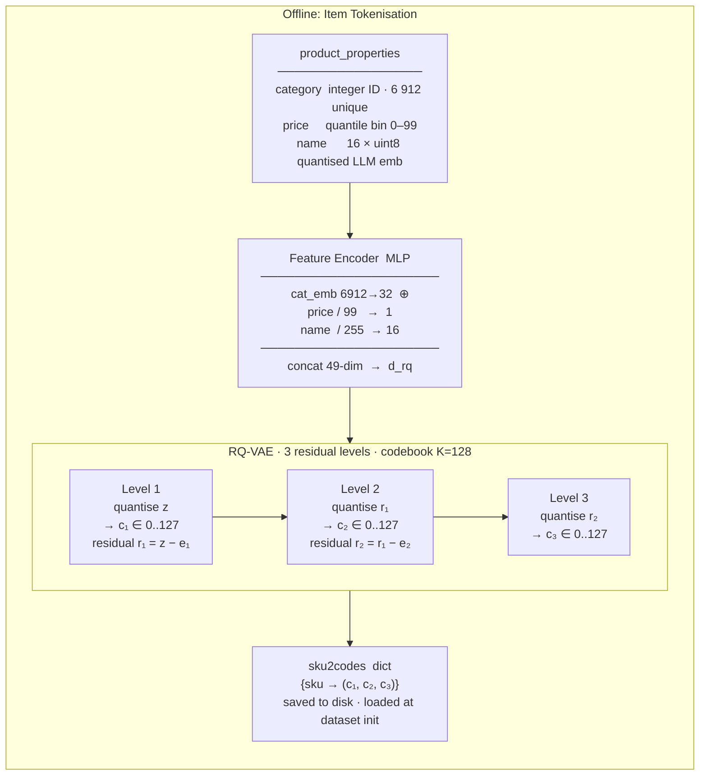
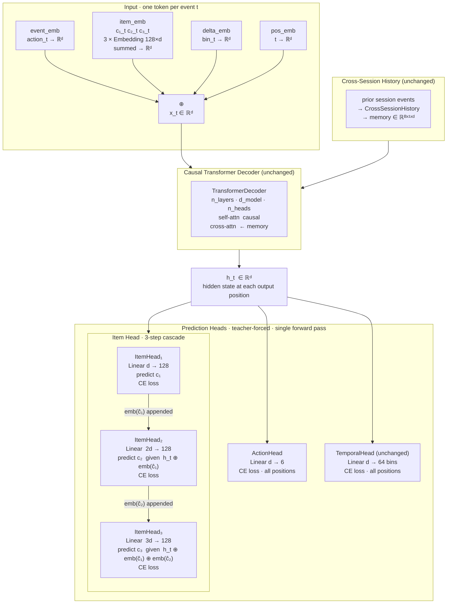

# Iteration 2 — SessionTransformer with RQ-VAE Item Tokenisation

## Key change from Iteration 1

Replaces the single 630k-way item embedding + projection with a two-stage system:
an **offline RQ-VAE** that tokenises each SKU into 3 discrete codes, and an
**online 3-step item head** that predicts those codes sequentially.
The transformer backbone, action head, and temporal head are unchanged.

---

## Offline Stage — Item Tokenisation (run once before training)



**Coverage:** 128³ = 2 097 152 combinations → uniquely covers all 1.5M SKUs.
**Parameter cost:** 3 × 128 × d\_rq  ≪  630k × d (iteration 1).

---

## Online Stage — SessionTransformer (iteration 2)



---

## Loss function

```
loss = action_loss
     + item_loss_c1 + item_loss_c2 + item_loss_c3
     + temporal_loss
```

Item loss is now three 128-way cross-entropy terms (one per code level) computed
only at item-bearing positions, identical masking logic to iteration 1.

---

## Parameter comparison

| Component            | Iteration 1          | Iteration 2             | Δ           |
|----------------------|----------------------|-------------------------|-------------|
| item\_emb            | Embedding 630k × d   | 3 × Embedding 128 × d   | −99.9%      |
| item\_head           | Linear d → 630k      | 3 × Linear ~3d → 128    | −99.9%      |
| Logit tensor / batch | M × 630k (≈ 1.2 GB)  | 3 × M × 128 (< 1 MB)   | −1 600×     |
| Action head          | unchanged            | unchanged               | —           |
| Temporal head        | unchanged            | unchanged               | —           |
| Transformer backbone | unchanged            | unchanged               | —           |

---

## Inference — autoregressive item sampling

```
h_t  →  ItemHead₁  →  sample ĉ₁  →  emb(ĉ₁)
                                          ↓
                    h_t ⊕ emb(ĉ₁)  →  ItemHead₂  →  sample ĉ₂  →  emb(ĉ₂)
                                                                          ↓
                                   h_t ⊕ emb(ĉ₁) ⊕ emb(ĉ₂)  →  ItemHead₃  →  sample ĉ₃
                                                                                      ↓
                                                                  lookup (ĉ₁,ĉ₂,ĉ₃) → SKU
```

Three 128-way multinomial samples replace one 630k-way sample.

---

## Citations

- van den Oord et al., *Neural Discrete Representation Learning*, NeurIPS 2017 (VQ-VAE)
- Lee et al., *Autoregressive Image Generation using Residual Quantization*, CVPR 2022 (RQ-VAE)
- Rajput et al., *Recommender Systems with Generative Retrieval*, NeurIPS 2023 (RQ-VAE for item tokenisation)
- Liu et al., *Multi-Behavior Generative Recommendation*, WWW 2024 (MBGen)
- Hou et al., *Generative Augmentation and Multi-lEvel behavior modeling for Recommendation*, 2024 (GAMER)
